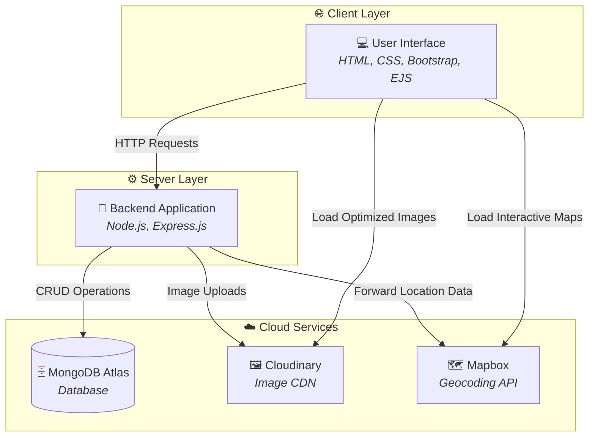
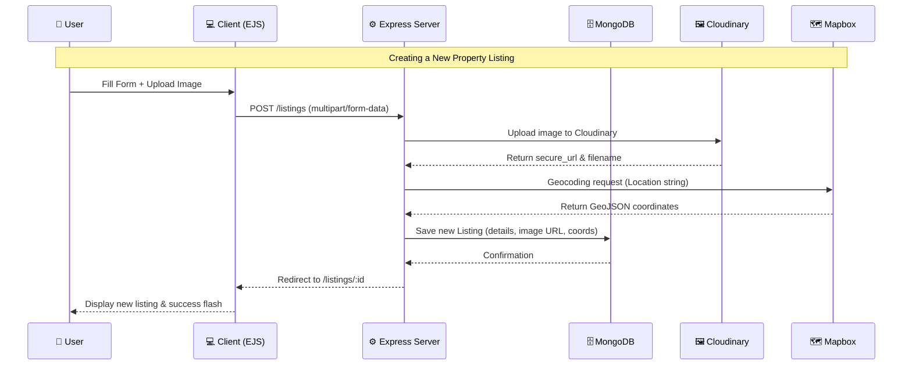
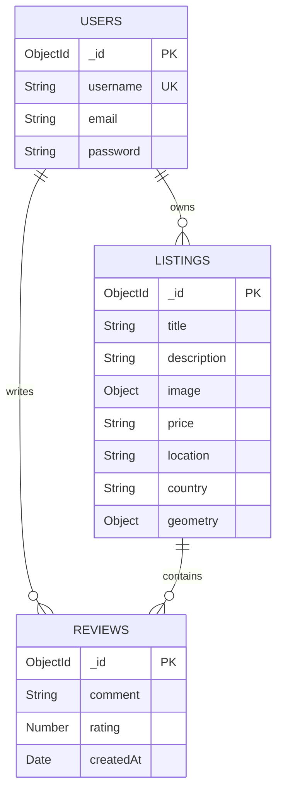

<div align="center">

# 🏡 BookVilla — Full-Stack Vacation Rental Platform

### A modern, production-ready property booking application built with the MEN stack (MongoDB, Express.js, Node.js)

[](https://nodejs.org/)
[](https://www.mongodb.com/)
[](https://ejs.co/)
[](https://cloudinary.com/)
[](https://www.mapbox.com/)

[🌐 Live Site](#) <!-- Add live link here when deployed -->

</div>

---

## 📌 About

**BookVilla** is a full-stack web application designed for booking vacation rentals, properties, and experiences (inspired by Airbnb). It allows users to browse worldwide properties, view their exact locations on interactive maps, leave reviews, and host their own properties. 

Built using a robust monolithic architecture with server-side rendering, secure authentication, and cloud integrations for imagery and geocoding.

---

## ✨ Features

### 🏕️ Property Exploration
- Browse diverse listings across categories (Trending, Rooms, Iconic Cities, Mountains, Castles, Amazing Pools, Camping, Farms, etc.)
- **Global Search Bar** — Instantly search and filter properties by name.
- Interactive **Mapbox Integration** — View exact coordinates and location markers for every property on a dynamic map.
- **Dynamic Pricing** — Real-time tax toggle to view prices with or without GST.
- Flash **Toasts & Notifications** for successes, warnings, and errors.
- Fully responsive UI using Bootstrap and custom CSS.

### 🔐 User & Host Experience
- **Protected Authentication** — Secure login/signup via `passport-local-mongoose`.
- **Session Management** — Persistent sessions across page reloads using MongoDB store.
- Authorized hosts can create, edit, and delete their own property listings.
- Image uploads are seamlessly managed and optimized using **Cloudinary**.
- Users can leave ratings and reviews on properties they have visited.
- Authorization checks ensure users can only modify/delete their own reviews and listings.

### 🔌 Robust Backend
- Built on a RESTful MVC (Model-View-Controller) architecture using Express.js.
- MongoDB Atlas for a scalable, cloud-native NoSQL database.
- Data validation and error handling using Joi.
- Military-grade session security and password hashing.

---

## 🏗️ System Architecture



---

## 🔄 Request Flow



---

## 🛠️ Tech Stack

| Layer | Technology | Purpose |
|:---:|:---|:---|
| **Frontend UI** | HTML5, CSS3, Bootstrap 5 | Responsive layout and styling |
| **Templating** | EJS (Embedded JavaScript), EJS-Mate | Server-side HTML generation |
| **Backend** | Node.js, Express.js | Application server & routing |
| **Database** | MongoDB Atlas, Mongoose | Cloud NoSQL database & ORM |
| **Authentication** | Passport.js, Express-Session | Secure local strategy auth |
| **Cloud Storage** | Cloudinary, Multer | Image hosting & multipart parsing |
| **Geocoding** | Mapbox SDK | Forward geocoding & interactive maps |

---

## 📂 Project Structure

```
BookVilla/
├── controllers/               # Route logic separated from routing
├── init/                      # Database initialization and seed data
├── models/                    # Mongoose schemas
│   ├── listing.js             # Property listing schema
│   ├── review.js              # Review schema
│   └── user.js                # User schema
├── public/                    # Static assets (CSS, JS, Images)
├── routes/                    # Express routers
│   ├── listing.js             # Listing CRUD routes
│   ├── review.js              # Review CRUD routes
│   └── user.js                # Authentication routes
├── utils/                     # Error handling and async wrappers
├── views/                     # EJS templates
│   ├── includes/              # Partials (Navbar, Footer, Flash)
│   ├── layouts/               # Boilerplate layouts
│   ├── listings/              # Listing views (Index, Show, Edit, New)
│   └── users/                 # Auth views (Login, Signup)
├── app.js                     # Main server entrypoint
├── middleware.js              # Auth & validation middlewares
├── cloudConfig.js             # Cloudinary configuration
└── schema.js                  # Joi validation schemas
```

---

## 🔌 API Reference (Internal MVC Routes)

### Listings

| Method | Endpoint | Description | Auth Required |
|:---:|:---|:---|:---:|
| `GET` | `/listings` | Show all properties | ❌ |
| `GET` | `/listings/search` | Search for a specific property | ❌ |
| `GET` | `/listings/new` | Render form to create property | ✅ |
| `POST` | `/listings` | Add new property | ✅ |
| `GET` | `/listings/:id` | View property details & map | ❌ |
| `GET` | `/listings/:id/edit`| Render form to edit property | ✅ (Owner) |
| `PUT` | `/listings/:id` | Update property | ✅ (Owner) |
| `DELETE`| `/listings/:id` | Delete property | ✅ (Owner) |

### Reviews

| Method | Endpoint | Description | Auth Required |
|:---:|:---|:---|:---:|
| `POST` | `/listings/:id/reviews` | Leave a rating and review | ✅ |
| `DELETE`| `/listings/:id/reviews/:reviewId`| Delete a review | ✅ (Author) |

### Authentication

| Method | Endpoint | Description |
|:---:|:---|:---|
| `GET` | `/signup` | Render signup form |
| `POST` | `/signup` | Register a new user |
| `GET` | `/login` | Render login form |
| `POST` | `/login` | Authenticate user |
| `GET` | `/logout` | Terminate session |

---

## 🚀 Getting Started

### Prerequisites

- **Node.js** v18+
- **MongoDB Atlas** account (or local MongoDB)
- **Cloudinary** account
- **Mapbox** Developer account

### 1. Clone the repository

```bash
git clone https://github.com/iZiaur/BookVilla.git
cd BookVilla
```

### 2. Install Dependencies

```bash
npm install
```

### 3. Configure Environment Variables

Create a `.env` file in the root directory:

```env
ATLASDB_URL=your_mongodb_connection_string
SECRET=your_express_session_secret
CLOUD_NAME=your_cloudinary_cloud_name
CLOUD_API_KEY=your_cloudinary_api_key
CLOUD_API_SECRET=your_cloudinary_api_secret
MAP_TOKEN=your_mapbox_public_token
```

### 4. Initialize Database (Optional)

If you want to seed your database with initial sample data:
```bash
cd init
node index.js
cd ..
```

### 5. Start the Server

```bash
npm start
# or use nodemon:
nodemon app.js
```

> Server runs locally at `http://localhost:8080`

---

## 📊 Database Schema



---

## 🤝 Contributing

Contributions are always welcome! 

1. Fork the project
2. Create your feature branch (`git checkout -b feature/AmazingFeature`)
3. Commit your changes (`git commit -m 'Add some AmazingFeature'`)
4. Push to the branch (`git push origin feature/AmazingFeature`)
5. Open a Pull Request

---

## 📄 License

This project is open source and available under the [ISC License](LICENSE).

---

<div align="center">

**Built with ❤️ by [Ziaur Rahman](https://github.com/iZiaur)**

⭐ Star this repo if you found it helpful!

</div>
